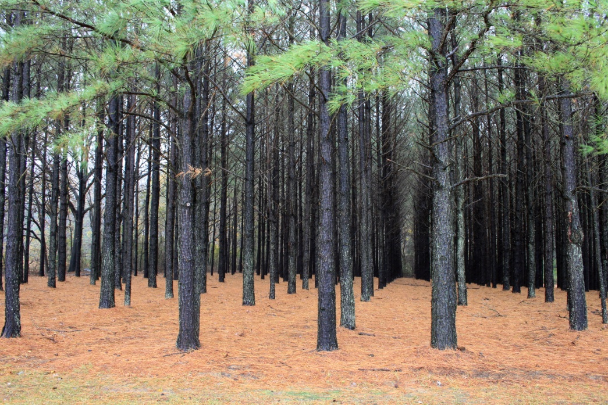
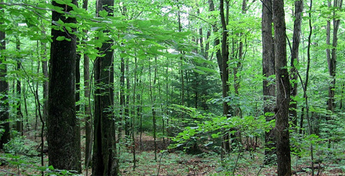

# Descriptive Statistics, Point Estimators, and Interval Estimators

As researchers in the forest and environmental sciences, perhaps the most important thing we do is organize, calculate measures, and present data in a way that makes it easy to understand the information contained in the data. Although this may initially sound simple, there are an immense number of ways to summarize different types of data. Our task is to identify the data type and choose the most *appropriate* summary measure and/or graphical display for each specific goal we seek to accomplish. In this chapter, we will learn the basic tools necessary to accomplish these tasks. Specifically, we will present a brief overview of possible descriptive statistics, point estimators, and interval estimators to describe a data set, as well as learn the necessary code in `R` to obtain these estimators and produce basic plots of our data.

## Descriptive Statistics 101

Two central concepts to any ecological data set are the population and sample. A *Population* is a complete set of items that share at least one property in common that is the subject of a statistical analysis. The population is the unit on which we seek inference. If we want to determine the mean DBH of trees in East Lansing, the population is *all* trees in East Lansing. If we want to determine the mean volume of oak trees in a national park, the population consists of all oak trees in the national park. 

As is clear from these two examples, it is often not reasonable to obtain a measurement for the entire population to answer our question of interest. One of the primary goals of statistics is to use a sample to draw inference about an entire population. A *Sample* is a subset drawn from the population to represent the population in a statistical analysis. If the sample is selected properly, we can use it to draw inference about the population. We will learn about useful sample schemes in great depth in Chapters **cite chapters here**, but for now we move forward with our initial exploration of descriptive statistics. 

When a sample of data is collected, there is variabiltiy in the different observations. When measuring DBH of trees in a forest stand, there is large variability in the measurements from individual to individual as a result of the species of the indvidual, location, age, measurement error, etc. This creates a *distribution* of measurements that we can visualize to obtain information regarding our collected sample. 

One simple and useful way to visualize a data distribution is to use a *Histogram*. Figure \@ref(fig:hists) displays three very different histograms. A *Symmetric* distribution is a distribution such that the vertical axis divides the distribution into two identical parts. A *Skewed* distribution is *Asymmetric* (cannot be divided into two equal parts along the vertical axis). A *Positive Skewed* distribution is a distribution that has a long tail to the right, while a *Negative Skewed* distribution has a long tail to the left. Looking at the data points themselves, it is quite difficult to determine whether or not the data are symmetric or skewed, but it is clear from Figure \@ref(fig:hists) that creating simple histograms to visualize the data makes it very easy to determine the skewness of the data. 

```{r hists, echo = FALSE, fig.show = 'hold', fig.cap = 'Symmetric and asymmetric distributions of simulated data', out.width = '33%'}
x <- rnorm(10000)
hist(x, las = 1, col = 'grey', main = 'Symmetric')
y <- rbeta(10000, 2, 10)
hist(y, las = 1, col = 'grey', main = 'Asymmetric: Positive Skewed')
z <- rbeta(10000, 10, 2)
hist(z, las = 1, col = 'grey', main = 'Asymmetric: Negative Skewed')
```

<!-- We can produce very useful visualizations of data distributions using `R` with just a few lines of code. Here we'll work with the FEF Tree Biomass Data Set introduced in Chapter \@ref(data). Below we read in the data using the `read.csv` function and then use the `str()` function to look at the structure of the data set.  -->

<!-- ```{r} -->
<!-- fef <- read.csv("../datasets/RDS-2016-0016/Data/felled_tree_biomass.csv") -->
<!-- str(fef) -->
<!-- ``` -->

<!-- The output from the `str` function shows us that there are a total of 88 trees and 18 variables in the data set. Let's take a look at the distribution of the dry stem weight of the trees in the data set by creating a histogram using the simple `hist` function.  -->

<!-- ```{r} -->
<!-- hist(x = fef$stem_dry_kg) -->
<!-- ``` -->

<!-- What do you notice about the distribution? First you may notice the large variety in the values of `fef$stem_dry_kg`, as the x-axis shows values that range from close to zero to 150. Perhaps more notably, there are clearly a lot of trees with a small dry stem weight and only a few trees with a larger dry stem weight. This type of distribution is said to be *Right Skewed*.  -->


## Measures of Central Tendency

Visualizing a data set using histograms is a great way to get an idea of the data distribution and common values in the data set, but we typically want a quantitative measure to describe the central tendency, or a typical value, of a data set. We will explore four measures of central tendency: 

1. Arithmetic Mean
2. Quadratic Mean
3. Median
4. Mode

### Arithmetic Mean

The arithmetic mean (often called simply the mean) is the unweighted average of a set of data points. There are two arithmetic means of interest to us: 

1. Population

\begin{equation}
\mu = \frac{\sum_{i = 1}^Nx_i}{N}
(\#eq:popMean)
\end{equation}

where $N$ is the total number of units in the population, and $x_i$ for $i = 1, 2, \dots N$ are the data points. 

2. Sample

\begin{equation}
\bar{x} = \frac{\sum_{i = 1}^nx_i}{n}
(\#eq:sampleMean)
\end{equation}

where $n$ is the number of sample units. 

The arithmetic mean is a very common summary measure of a data set. However, the arithmetic mean is very sensitive to extreme values and hence it is not always the best summary of central tendency. 

### Quadratic Mean 

An alternative measure of central tendency is the quadratic mean. Again, we distinguish between the population and sample quadratic means: 

1. Population 

\begin{equation}
\mu_Q = \sqrt{\frac{\sum_{i = 1}^Nx_i^2}{N}}
(\#eq:popQuadMean)
\end{equation}

2. Sample

\begin{equation}
\bar{x}_Q = \sqrt{\frac{\sum_{i = 1}^nx_i^2}{n}}
(\#eq:sampleQuadMean)
\end{equation}

The quadratic mean is often used in forestry for reporting average stand diameter (i.e., quadratic mean diameter (QMD)). It is common in most yield tables, simulator output, and stand summaries. 

### Median

The median is defined as the value in an ordered set of values below and above which there is an equal number of values, or which is the arithmetic mean of the two middle values if there is no one middle number. Unlike the arithmetic mean, the median is unaffected by extreme values, making it an attractive alternative to the mean when a data set is highly skewed or has outliers. 

### Mode 

The mode is the value that occurs most frequently in a data set. A distribution could have no mode, one mode (unimodal), two modes (bimodal), or several modes (multimodal). The mode is useful for qualitative and quantiative variables. 

### Symmetrical and Skewed Distributions

By looking at our four measures of central tendency for both symmetrical and skewed distributions, we can get an idea of how these measures vary under different circumstances. Figure \@ref(fig:symmetric) shows a symmetrical distribution. A nice property of symmetrical distriutions is that the mean and median coincide. 

```{r symmetric, echo = FALSE, fig.cap = 'Measures of central tendency in a symmetric distribution.'}
library(ggplot2)
quad.mean <- function(x) {
  sqrt(sum(x^2) / length(x))
}
theme_set(theme_bw(base_size = 18))
set.seed(10)
dat <- data.frame(x = 1:100000, y = rnorm(100000), 
                  val = 'Symmetric')
ggplot(data = dat, aes(x = y, fill = 'black')) + 
  geom_density(alpha = 0.5) +
  geom_vline(xintercept = 0, col = 'black') +
  guides(fill = FALSE) + 
  facet_wrap(val ~ .) + 
  labs(x = 'Parameter Value', y = 'Density') + 
  annotate("text", x = 0.5, y = 0.2, label = "Mean") + 
  annotate("text", x = 0.58, y = 0.15, label = 'Median') + 
  annotate('text', x = 0.5, y = 0.1, label = 'Mode') + 
  theme(axis.title.x=element_blank(),
        axis.text.x=element_blank(),
        axis.ticks.x=element_blank(), 
        axis.title.y = element_blank(), 
        axis.text.y = element_blank(), 
        axis.ticks.y = element_blank()) 
```

Looking at Figures \@ref(fig:rightSkewed) and \@ref(fig:leftSkewed) this is clearly not the case. In a positive skewed distribution, the distribution is skewed to the right (i.e., positive skew). The arithmetic mean is larger than the median, while the quadratic mean is larger than the arithmetic mean. On the other hand, a negative skewed distribution is skewed to the left (i.e., negative skew). In this case, the arithmetic mean is smaller than the median, while the quadratic mean is larger than the arithmetic mean. Note how in both types of skewness, the quadratic mean is larger than the arithmetic mean. 

```{r rightSkewed, echo = FALSE, fig.cap = 'Measures of central tendency for a positive skewed distribution'}
theme_set(theme_bw(base_size = 18))
set.seed(10)
dat <- data.frame(x = 1:100000, y = rbeta(10000, 2, 30), 
                  val = 'Positive Skewed')
curr.mean <- mean(dat$y)
curr.med <- median(dat$y)
curr.mode <- unique(dat$y)[which.max(tabulate(match(dat$y, unique(dat$y))))]
curr.quad <- quad.mean(dat$y)
ggplot(data = dat, aes(x = y, fill = 'black')) + 
  geom_density(alpha = 0.5) +
  geom_vline(xintercept = curr.med, col = 'blue') +
  geom_vline(xintercept = curr.mean, col = 'brown') + 
  geom_vline(xintercept = curr.mode, col = 'black') + 
  geom_vline(xintercept = curr.quad, col = 'red') + 
  guides(fill = FALSE) + 
  facet_wrap(val ~ .) + 
  labs(x = 'Parameter Value', y = 'Density') + 
  annotate("text", x = curr.mean - 0.01, y = 2, label = "Mean", color = 'brown') + 
  annotate("text", x = curr.med - 0.015, y = 5, label = 'Median', col = 'blue') + 
  annotate('text', x = curr.mode + 0.01, y = 7, label = 'Mode', col = 'black') + 
  annotate('text', x = curr.quad + 0.03, y = 10, label = 'Quadratic Mean', col = 'red') + 
  theme(axis.title.x=element_blank(),
        axis.text.x=element_blank(),
        axis.ticks.x=element_blank(), 
        axis.title.y = element_blank(), 
        axis.text.y = element_blank(), 
        axis.ticks.y = element_blank()) 
```

```{r leftSkewed, echo = FALSE, fig.cap = 'Measures of central tendency for a left skewed distribution'}
theme_set(theme_bw(base_size = 18))
set.seed(10)
dat <- data.frame(x = 1:100000, y = rbeta(10000, 30, 2), 
                  val = 'Positive Skewed')
curr.mean <- mean(dat$y)
curr.med <- median(dat$y)
curr.mode <- unique(dat$y)[which.max(tabulate(match(dat$y, unique(dat$y))))]
curr.quad <- quad.mean(dat$y)
ggplot(data = dat, aes(x = y, fill = 'black')) + 
  geom_density(alpha = 0.5) +
  geom_vline(xintercept = curr.med, col = 'blue') +
  geom_vline(xintercept = curr.mean, col = 'brown') + 
  geom_vline(xintercept = curr.mode, col = 'black') + 
  geom_vline(xintercept = curr.quad, col = 'red') + 
  guides(fill = FALSE) + 
  facet_wrap(val ~ .) + 
  labs(x = 'Parameter Value', y = 'Density') + 
  annotate("text", x = curr.mean - 0.013, y = 2, label = "Mean", color = 'brown') + 
  annotate("text", x = curr.med + 0.015, y = 5, label = 'Median', col = 'blue') + 
  annotate('text', x = curr.mode - 0.01, y = 7, label = 'Mode', col = 'black') + 
  annotate('text', x = curr.quad + 0.03, y = 10, label = 'Quadratic Mean', col = 'red') + 
  theme(axis.title.x=element_blank(),
        axis.text.x=element_blank(),
        axis.ticks.x=element_blank(), 
        axis.title.y = element_blank(), 
        axis.text.y = element_blank(), 
        axis.ticks.y = element_blank()) 
```

## Measures of Dispersion

Note that up until this point, we have only considered describing a data set by a single measure of central tendency. While useful, a single measure of central tendency, a type of *Point Estimate*, does not provide us with any information regarding the *variability* or *dispersion* of a data set. Understanding the dispersion of a set of data is arguably equally important as understanding the central tendencies of the data as well. 

To motivate our exploration of measures of dispersion, consider the following two forest stands shown in Figures \@ref(fig:evenForest) and \@ref(fig:unevenForest). Suppose the two forest stands had the same mean DBH. If we were to solely focus on this mean value, we would not recognize any differences in DBH between the two stands. However, there are clear differences when looking at the images. The trees in \@ref(fig:evenForest) all appear to have very similar DBH values. In other words, there is small dispersion around the mean. On the other hand, the trees in \@ref(fig:unevenForest) have a wide range of DBH values; there is a large dispersion around the mean. 

```{r evenForest, out.width = '50%', fig.cap = 'A forest with small variability in DBH across individual trees.', echo = FALSE}

```

```{r unevenForest, out.width = '50%', fig.cap = 'A forest with large variability in DBH across individual trees.', echo = FALSE}

```

Thus we see that when reporting values it will be important for us to include measures of central tendency as well as measures of variability around this measure. Here we will briefly explore five measures of dispersion: 

1. Variance
2. Standard Deviation
3. Coefficient of Variation
4. Range
5. Inter-quartile Range

### Variance

One of the most common measures of dispersion is **Variance**. The variance is a measure of variation of individual values around their mean. Similarly to our measures of central tendency, we distinguish between the population variance and the sample variance: 

Population: 

$$
\sigma^2 = \frac{\sum_{i = 1}^N(x_i - \mu)^2}{N}
$$

where $\mu$ is the population mean and $N$ is the total number of units in the population. 

Sample: 

$$
s^2 = \frac{\sum_{i = 1}^n(x_i - \bar{x})^2}{n - 1}
$$

where $\bar{x}$ is the sample mean and $n$ is the number of sample units. The numerator $\sum_{i = 1}^n(x_i - \bar{x})^2$ is an important value known as the *Sum of Squares*. 


### Standard Deviation

The standard deviation is simply the square root of the variance, and thus also represents a measure of variation of individual values about their mean: 

Population 

$$
\sigma = \sqrt{\sigma^2}
$$
Sample

$$
s = \sqrt{s^2}
$$


### Coefficient of Variation

The coefficient of variation is the standard deviation expressed as a percentage of the mean. We will primarily use the sample coefficient of variation: 

$$
\text{C.V.} = \frac{s}{\bar{x}} \times 100
$$

## Bias, Accuracy, and Precision


## Sumarizing Uncertainty

A **Point Estimate** is a single value given as an estimate for a population parameter. They are typically measures of a sample's central tendency (or derived from such estimates, like sample totals or population totals). As we have noted earlier in our discussion on dispersion estimates, a point estimate is not that useful if we don't provide a measure of how certain (or uncertain) we are in that value. In fact, you should always be very skeptical if you are reading a publication or any article that provides a point estimate without any uncertainty estimation. This idea was summarized quite succinctly by Frank Freese, a statistician with the Forest Service: 

> We have it on good authority that "you can fool all of the people some of the time". The oldest device for misleading folks is the barefaced lie. A method that is nearly as effective and far more subtle is to report a sample estimate without any indication of its reliability.

Statistics is the science of uncertainty, and so we will always seek to obtain point estimates for our data at hand and provide the associated measures of uncertainty regarding those point estimates. To do this requires the use of some of the measures of dispersion we previously introduced. 

### Standard Error of the Mean

Recall the standard deviation $s$ is a relatively intuitive measure of variation of individual sample observations about their mean (where $s = \sqrt{s^2}$ and $s^2$ is the sample variance). Now, suppose we draw $m$ different samples of size $n$ from a population, and we then calculate the mean for each of the $m$ different samples (i.e., we have $m$ different means). The *Standard Error* is a measure of variation of sample means about their mean (i.e., a measure of the variation of the $m$ different means around the mean of those $m$ different means). It is perhaps easiest to think of the standard error as the "standard deviation" among the means of $m$ samples, where $m$ is large. 

The standard error is a very useful measure that you will likely encounter on a daily basis. In this text, we use the standard error of the mean for two things: 

1. Computing confidence intervals for the population parameters (e.g, mean, total). In this case, it allows us to answer the question "how certain are we in our point estimate". 
2. Determining the sample size required to achieve a specified level of certainty in a population parameter estimate. In this case, it allows us to answer the question "how many samples should we collect?". 

Clearly these are two questions we want to know the answers to. We will first focus on the first question. But before we tackle that question, we need to define the standard error of the mean so we can calculate it. 

Given one simple random sample of size $n$ from our population of interest, the standard error of the mean is calculated as: 

\begin{equation}
s_{\bar{x}} = \sqrt{\frac{s^2}{n}} = \frac{s}{\sqrt{n}}
\end{equation}

Notice the two components of the standard error: $s$ and $n$. $s$ is an inherent property of our population of interest, and for the most part we don't have any control over this value. However, we can control the sample size $n$, and thus we can obtain control over the standard error of the mean (i.e., we can control the uncertainty around our estimate for the mean). 

When sampling without replacement from a finite population, the standard of the mean is 

\begin{equation}
s_{\bar{x}} = \sqrt{\frac{s^2}{n}}\sqrt{\frac{N-n}{N}}
\end{equation}

where $N$ is the population size. 

### Confidence Intervals
