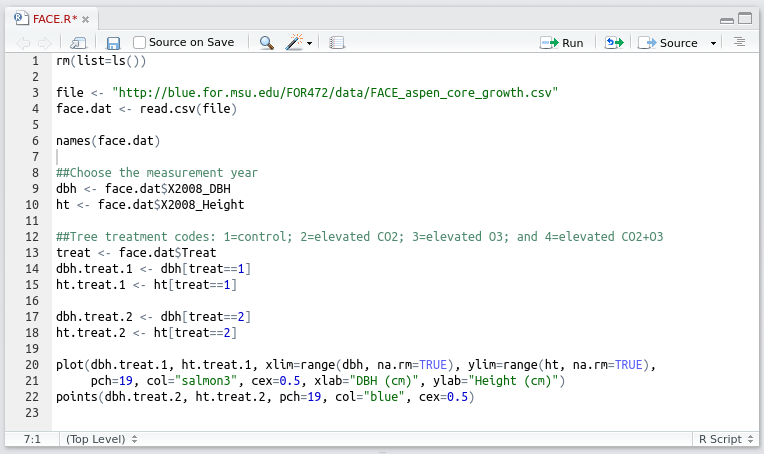

--- 
title: "Forestry 472: Ecological Monitoring and Data Analysis"
author: "Andrew O. Finley and Jeffrey W. Doser"
date: "`r Sys.Date()`"
documentclass: krantz
bibliography: [text.bib]
biblio-style: apalike
link-citations: yes
colorlinks: yes
lot: yes
lof: yes
site: bookdown::bookdown_site
description: "Course book for FOR472: Ecological Monitoring and Data Analysis"
graphics: yes
header-includes:
  - \usepackage{color}
---

```{r setup, include=FALSE}
options(
  htmltools.dir.version = FALSE, formatR.indent = 2, width = 55, digits = 4
)

# install the packages needed by this book; you fill out c(), e.g. c('ggplot2', 'dplyr')
lapply(c('xfun'), function(pkg) {
  if (system.file(package = pkg) == '') install.packages(pkg)
})
```

# Preface {-}

This text is an introduction to data sciences for Forestry and Environmental students. Understanding and responding to current environmental challenges requires strong quantitative and analytical skills. There is a pressing need for professionals with data science expertise in this data rich era. The [McKinsey Global Institute](http://www.mckinsey.com/insights/business_technology/big_data_the_next_frontier_for_innovation) predicts that "by 2018, the United States alone could face a shortage of 140,000 to 190,000 people with deep analytical skills as well as 1.5 million managers and analysts with the know-how to use the analysis of big data to make effective decisions". The Harvard Business Review dubbed *data scientist* ["The Sexiest Job of the 21st Century"](https://hbr.org/2012/10/data-scientist-the-sexiest-job-of-the-21st-century). This need is not at all confined to the tech sector, as forestry professionals are increasingly asked to assume the role of *data scientists* and *data analysts* given the rapid accumulation and availability of environmental data (see, e.g. @Schimel2015). [Thomson Nguyen's talk](www.import.io/post/data-scientists-vs-data-analysts-why-the-distinction-matters) on the difference between a data scientist and a data analyst is very interesting and contains elements relevant to the aim of this text. This aim is to give you the opportunity to acquire the tools needed to become an environmental data analyst. Following @Bravo16 a *data analyst* has the ability to make appropriate calculations, convert data to graphical representation, interpret the information presented in graphical or mathematical forms, and make judgements or draw conclusions based on the quantitative analysis of data. 


<!--chapter:end:index.Rmd-->

# Data

## FEF Tree Biomass Data Set {#fef}

When thinking about data, we might initially have in mind a modest-sized and uncomplicated data set that serves a fairly specific purpose. For example, in forestry it is convenient to have a mathematical formula that relates a tree's diameter (or some other easily measured attribute) to stem or total biomass (i.e. we cannot directly measure tree biomass without destructive sampling). When coupled with forest inventory data, such formulas provide a means to estimate forest biomass across management units or entire forest landscapes. A data set used to create such formulas includes felled tree biomass by tree component for four hardwood species of the central Appalachians sampled on the [Fernow Experimental Forest](http://www.nrs.fs.fed.us/ef/locations/wv/fernow) (FEF), West Virginia @Wood2016. A total of 88 trees were sampled from plots within two different watersheds on the FEF. Hardwood species sampled include *Acer rubrum*, *Betula lenta*, *Liriodendron tulipifera*, and *Prunus serotina*, all of which were measured in the summer of 1991 and 1992. Data include tree height, diameter, as well as green and dry weight of tree stem, top, small branches, large branches, and leaves. Table \@ref(tab:sppbio) shows a subset of these data

```{r sppbio, echo = FALSE, results = 'asis'}
library(knitr)
dat <- read.csv("../datasets/RDS-2016-0016/Data/felled_tree_biomass.csv")
dat <- dat[1:10,c("species", "dbh_in", "height_ft", "stem_green_kg", "leaves_green_kg")]
kable(
  dat, booktabs = TRUE, 
  caption = "A subset of the tree biomass data from the FEF."
)
```

The size of this dataset is relatively small, there are no missing observations, the variables are easily understood, etc. 

## FACE Experiment Data Set

We often encounter data gleaned from highly structured and complex experiments. Such data typically present challenges in organization/storage, exploratory data analysis (EDA), statistical analysis, and interpretation of analysis results. An example data set comes from the Aspen [Free-Air Carbon Dioxide Enrichment](http://www.nrs.fs.fed.us/disturbance/climate_change/face) (FACE) Experiment conducted from 1997-2009 on the [Harshaw Experimental Forest](http://www.nrs.fs.fed.us/ef/locations/wi/rhinelander/) near Rhinelander, Wisconsin. The Aspen FACE Experiment was a multidisciplinary study that assessed the effects of increasing tropospheric ozone and carbon dioxide concentrations on the structure and functioning of northern forest ecosystems. The design provided the ability to assess the effects of these gasses alone (and in combination) on many ecosystem attributes, including growth, leaf development, root characteristics, and soil carbon. The data set considered here comprises annual tree height and diameter measurements from 1997 to 2008 for *Populus tremuloides*, *Acer saccharum*, and *Betula papyrifera* grown within twelve 30 meter diameter rings in which the concentrations of tropospheric ozone and carbon dioxide were controlled @Kubiske2013. Because there was no confinement, there was no significant change in the natural, ambient environment other than elevating these trace gas concentrations. Although the basic individual tree measurements are similar to those in the FEF data set we saw in Section~\@ref(fef), (i.e., height and diameter), the study design specifies various tree species clones, varying gas treatments, and treatment replicates. Further, because these are longitudinal data, (measurements were recorded over time) the data set presents many missing values as a result of tree mortality. Table \@ref(tab:face) contains the first five records as well as 5 more randomly selected records in the data set. Here, a row identifies each tree's experimental assignment, genetic description, and growth over time.

```{r face, echo = F, results = 'asis'}
set.seed(5)
dat <- read.csv("../datasets/RDS-2013-0015/Data/FACE_aspen-birch_core_growth.csv")
rows <- sample(1:dim(dat)[1], size=5)
kable(
  dat[c(1:5, rows), c(1:4, 7, 8, 34)], booktabs = TRUE,
  caption = "A small portion of the FACE experiment data set"
)
```

Notice that several height measurements in 2008 contain missing data. If all year measurements were shown, we would see much more missing data. Also, notice that this data set is substantially larger than the FEF data set with `r dim(dat)[1]` rows and `r dim(dat)[2]` columns of data in the full data set.

## PEF Inventory and LiDAR Data Set {#pef}

Coupling forest inventory with remotely sensed Light Detection and Ranging (LiDAR) data sets using regression models offers an attractive approach to mapping forest variables at stand, regional, continental, and global scales. LiDAR data have shown great potential for use in estimating spatially explicit forest variables over a range of geographic scales [@asner2009], [@babcock2013], [@finley2011], [@naesset2011], [@neigh2013]. Encouraging results from these and many other studies have spurred massive investment in new LiDAR sensors, sensor platforms, as well as extensive campaigns to collect field-based calibration data. 

Much of the interest in LiDAR based forest variable mapping is to support carbon monitoring, reporting, and verification (MRV) systems, such as defined by the United Nations Programme on [Reducing Emissions from Deforestation and Forest Degradation](http://www.un-redd.org) (UN-REDD) and NASA's [Carbon Monitoring System](http://carbon.nasa.gov) (CMS) [@le2011], [@ometto2014]. In these, and similar initiatives, AGB is the forest variable of interest because it provides a nearly direct measure of forest carbon (i.e., carbon comprises $\sim 50$\% of wood biomass, @west2004). Most efforts to quantify and/or manage forest ecosystem services (e.g., carbon, biodiversity, water) seek high spatial resolution wall-to-wall data products such as gridded maps with associated measures of uncertainty, e.g., point and associated credible intervals (CIs) at the pixel level. In fact several high profile international initiatives include language concerning the level of spatially explicit acceptable error in total forest carbon estimates, see, e.g., @REDD2009 and @UNFCCC2015.

Here, we consider a data set collected on the [Penobscot Experimental Forest](www.fs.fed.us/ne/durham/4155/penobsco.htm) (PEF) in Bradley and Eddington, Maine. The dataset comprises LiDAR waveforms collected with the [Laser Vegetation Imaging Sensor](http://lvis.gsfc.nasa.gov) (LVIS) and several forest variables measured on a set of 589 georeferenced forest inventory plots. The LVIS data were acquired during the summer of 2003. The LVIS instrument, an airborne scanning LiDAR with a 1064 nm laser, provided 12,414 LiDAR pseudo-waveform signals within the PEF. For each waveform, elevations were converted to height above the ground surface and interpolated at 0.3 m intervals. Figure \@ref(fig:img1) shows PEF LiDAR energy returns at 12 m above the ground, forest inventory plot locations, and management unit boundaries. The forest inventory data associated with each plot were drawn from the PEF's database of several on-going, long-term silvicultural experiments (see @Kenefic2015). Below we provide a plot containng the geographic coordinates, biomass (mg/ha), basal area (m$^2$/ha), stocking (trees/ha), diameter class (cm), and management unit. Table \@ref(tab:pef) shows a subset of data for 10 randomly selected plots (where each row records plot measurements) in the forest inventory data set.  

```{r pef, echo=F, results='asis'}
dat <- read.csv("../datasets/PEF/PEF-plots.csv")
set.seed(5)
rows <- sample(1:dim(dat)[1], size=10)
kable(
  dat[rows, 1:6], booktabs = TRUE, 
  caption = "A small portion of the PEF inventory data set"
)
```

```{r img1, echo = FALSE, cache = TRUE, message = FALSE, warning = FALSE, fig.width = 8, fig.height = 8, fig.cap= "Surface of LiDAR energy returns at 12 m above the ground, forest inventory plot locations, and management unit boundaries on the PEF."}
library(fields)
library(MBA)
library(rgdal)

lvis <- read.csv("../datasets/PEF/PEF-LVIS.csv.gz")

PEF.shp <- readOGR("../datasets/PEF/","MU-bounds", verbose=FALSE)
b.box <- as.vector(t(bbox(PEF.shp)))
 
surf <- mba.surf(lvis[,c(1,2,42)], no.X=100, no.Y=100, b.box=b.box, sp=TRUE, extend=TRUE)$xyz.est
proj4string(surf) <- proj4string(PEF.shp)
surf <- as.image.SpatialGridDataFrame(surf[PEF.shp,])
image.plot(surf, xaxs = "r", yaxs = "r", xlab="Easting (m)", ylab="Northing (m)")
plot(PEF.shp, add=TRUE)
points(dat[,c("easting","northing")], pch=19, cex=0.5)
```

##Z&uuml;richberg Forest inventory data set {#zf}
Measuring tree diameter and height is a time consuming process. This fact makes the Z&uuml;richberg Forest inventory data set a rare and impressive investment. These data comprise a complete enumeration of the `r dim(dat)[1]` trees in the Z&uuml;richberg Forest, including species, diameter at breast height, basal area, and volume. The stem map colored by species is shown in Figure \@ref(fig:zf).

```{r, echo = FALSE, results = 'asis'}
dat <- read.csv("../datasets/ZF/ZF-trees.csv")
```

```{r zf, echo=FALSE, cache=TRUE, message=FALSE, warning=FALSE, fig.width= 8, fig.height = 8, fig.cap = "Location and species of all trees in the Z&uuml;richberg Forest."}
coords <- dat[,c("X_TREE", "Y_TREE")]

spp.name <- c("beech","maple","ash","other broadleaves",
              "spruce","silver fir", "larch", "other coniferous")

spp.col <- c("steelblue1","red","orange","pink",
             "green","dark green","black","gray")
                 
plot(coords, col=spp.col[dat$SPP+1],
     pch=19, cex=0.25, ylab="Northing", xlab="Easting")

legend.coords <- c(23,240)

legend(legend.coords, pch=19, legend=spp.name,
       col=spp.col, bty="n")
```

## Looking Forward

The four examples above illustrate a variety of data sets that might be encountered in practice, and each provides its own challenges. For the FACE data, the challenges are more statistical in nature. Complications could arise related to the complex study design and how that design might affect methods of analysis and conclusions drawn from the study. The other data sets present different challenges, such as how to:

1. Develop biomass equations suitable for population inference from the FEF's small sample of 88 trees
2. Work with spatially indexed data in the case of the PEF and Z&uuml;richberg inventory data
3. Effectively and efficiently process the PEF's high-dimentional LiDAR signal data for use in predictive models of forest variables.

This book and associated material introduce tools to tackle some of the challenges in working with real data sets within the context of the R statistical system. We will focus on important topics such as

+ Obtaining and manipulating data
+ Summarizing and visualizing data
+ Communicating findings about data that support reproducible research 
+ Programming and writing functions
+ Working with specialized data structures, e.g., spatial data and databases


## How to Learn (The Most Important Section in This Book!)

There are several ways to engage with the content of this book and associated materials. 

One way is not to engage at all. Leave the book closed on a shelf and do something else with your time. That may or may not be a good life strategy, depending on what else you do with your time, but you won't learn much from the book!

Another way to engage is to read through the book "passively", reading all that's written but not reading the book with R open on your computer, where you could enter the R commands from the book. With this strategy you'll probably learn more than if you leave the book closed on a shelf, but there are better options.

A third way to engage is to read the book while you're at a computer with R, and to enter the R commands from the book as you read about them. You'll likely learn more this way.

A fourth strategy is even better. In addition to reading and entering the commands given in the book, you think about what you're doing, and ask yourself questions (which you then go on to answer). For example, after working through some R code computing the logarithm of positive numbers you might ask yourself, "What would R do if I asked it to calculate the logarithm of a negative number? What would R do if I asked it to calculate the logarithm of a really large number such as one trillion?" You could explore these questions easily by just trying things out in the R Console window. 

If your goal is to maximize the time you have to binge-watch \emph{Stranger Things} Season 2 on Netflix, the first strategy may be optimal. But if your goal is to learn a lot about computational tools for data science, the fourth strategy is probably going to be best.


<!--chapter:end:01-introduction.Rmd-->

# Introduction to R and RStudio

Various statistical and programming software environments are used in data science, including R, Python, SAS, C++, SPSS, and many others. Each has strengths and weaknesses, and often two or more are used in a single project. This book focuses on R for several reasons:

1. R is free
2. It is one of, if not the, most widely used software environments in data science
3. R is under constant and open development by a diverse and expert core group
4. It has an incredible variety of contributed packages
5. A new user can (relatively) quickly gain enough skills to obtain, manage, and analyze data in R

Several enhanced interfaces for R have been developed. Generally such interfaces are referred to as *integrated development environments (IDE)*. These interfaces are used to facilitate software development. At minimum, an IDE typically consists of a source code editor and build automation tools. We will use the RStudio IDE, which according to its developers "is a powerful productive user interface for R.^[http://www.rstudio.com/]
RStudio is widely used, it is used increasingly in the R community, and it makes learning to use R a bit simpler. Although we will use RStudio, most of what is presented in this book can be accomplished in R (without an added interface) with few or no changes. 

## Obtaining and Installing R

It is simple to install R on computers running Microsoft Windows, macOS, or Linux. For other operating systems users can compile the source code directly.^[Windows, macOS, and Linux users also can compile the source code directly, but for most it is a better idea to install R from already compiled binary distributions.]
Here is a step-by-step guide to installing R for Microsoft Windows.^[New versions of R are released regularly, so the version number in Step 6 might be different from what is listed below.] macOS and Linux users would follow similar steps.

1. Go to http://www.r-project.org/
2. Click on the `CRAN` link on the left side of the page
3. Choose one of the mirrors.^[The http://cran.rstudio.com/ mirror is usually fast. Otherwise choose a mirror in Michigan.]
4. Click on `Download R for Windows`
5. Click on `base`
6. Click on `Download R 3.5.0 for Windows`
7. Install R as you would install any other Windows program

## Obtaining and Installing RStudio

You must install R prior to installing RStudio. RStudio is also simple to install:

1. Go to http://www.rstudio.com
2. Click on the link `RStudio` under the `Products` tab, then select the `Desktop` option
3. Click on the `Desktop` link
4. Choose the `DOWNLOAD RSTUDIO DESKTOP` link in the `Open Source Edition` column
5. On the ensuing page, click on the `Installer` version for your operating system, and once downloaded, install as you would any program

## Using R and RStudio
Start RStudio as you would any other program in your operating system. For example, under Microsoft Windows use the Start Menu or double click on the shortcut on the desktop (if a shortcut was created in the installation process). A (rather small) view of RStudio is displayed in Figure \@ref(fig:rstudio).

```{r rstudio, echo = FALSE, fig.cap = "The Rstudio IDE."}
include_graphics("02-introToR/02-images/RStudio.png")
```

Initially the RStudio window contains three smaller windows. For now our main focus will be the large window on the left, the `Console` window, in which R statements are typed. The next few sections give simple examples of the use of R. In these sections we will focus on small and non-complex data sets, but of course later in the book we will work with much larger and more complex sets of data.  Read these sections at your computer with R running, and enter the R commands there to get comfortable using the R console window and RStudio.

### R as a calculator
R can be used as a calculator. Note that `#` is the comment character in R, so R ignores everything following this character. Also, you will see that R prints `[1]` before the results of each command. Soon we will explain its relevance, but ignore this for now. The command prompt in R is the greater than sign `>`. 

```{r console, prompt=TRUE}
34+20*sqrt(100)  ## +,-,*,/ have the expected meanings
exp(2)  ##The exponential function
log10(100)  ##Base 10 logarithm
log(100)  ##Base e logarithm
10^log10(55)
```

Most functions in R can be applied to vector arguments rather than operating on a single argument at a time. A *vector* is a data structure that contains elements of the same data type (i.e. integers).

```{r vectorized, prompt=TRUE}
1:25 ##The integers from 1 to 25
log(1:25) ##The base e logarithm of these integers
1:25*1:25 ##What will this produce?
1:25*1:5 ##What about this?
seq(from=0, to=1, by=0.1) ##A sequence of numbers from 0 to 1
exp(seq(from=0, to=1, by=0.1)) ##What will this produce?
```

Now the mysterious square bracketed numbers appearing next to the output make sense. R puts the position of the beginning value on a line in square brackets before the line of output. For example if the output has 40 values, and 15 values appear on each line, then the first line will have `[1]` at the left, the second line will have `[16]` to the left, and the third line will have `[31]` to the left.

### Basic descriptive statistics and graphics in R {#sec:dec}
Of course it is easy to compute basic descriptive statistics and to produce standard graphical representations of data. For illustration consider the first 14 observations of tree height and DBH (diameter at breast height) from the FEF data set. We will begin by entering these data "by hand" using the `c()` function, which concatenates its arguments into a vector. For larger data sets we will clearly want an alternative way to enter data.

A style note: R has two widely used methods of assignment: the left arrow, which consists of a less than sign followed immediately by a dash: `<-` and the equals sign: `=`. Much ink has been used debating the relative merits of the two methods, and their subtle differences. Many leading R style guides (e.g., the Google style guide at https://google.github.io/styleguide/Rguide.xml and the Bioconductor style guide at http://www.bioconductor.org/developers/how-to/coding-style/) recommend the left arrow `<-` as an assignment operator, and we will use this throughout the book. 

Also you will see that if a command has not been completed but the ENTER key is pressed, the command prompt changes to a `+` sign.

```{r, prompt=TRUE}
dbh <- c(6, 6.9, 6.4, 6.5, 7.2, 3.1, 2, 4.1, 2.4, 2.7, 3.7, 6.3, 5.2, 5.1, 6.4)
ht <- c(48, 48, 48, 49, 51, 40, 30.5, 50, 28, 40.4, 42.6, 53, 55, 50, 50)
dbh
ht
```

Next we compute some descriptive statistics for the two numeric variables

```{r prompt=T}
mean(dbh)
sd(dbh)
summary(dbh)
mean(ht)
sd(ht)
summary(ht)
```
Next, a scatter plot of `dbh` versus `ht`:
```{r, fig=T, fig.align= "center"}
plot(dbh, ht)
```

Unsurprisingly as DBH increases, height tends to increase. We'll investigate this further using simple linear regression in the next section.

### Simple linear regression in R
The `lm()` function is used to fit linear models in R, including simple linear regression models. Here it is applied to the DBH height data. 

```{r, prompt=T, fig.align="center"}
ht.lm <- lm(ht ~ dbh) ##Fit the model and save it in ht.lm
summary(ht.lm)  ##Basic summary of the model
plot(dbh, ht) ##Scatter plot of the data
abline(ht.lm) ##Add the fitted regression line to the plot
```
We will work extensively with such models later in the text. We will also talk about why it might not be a good idea to assume a linear relationship between DBH and height---can you guess why this is by looking at the data scatter and model fitted line in the plot above?

## How to Learn

There are several ways to engage with the content of this book and associated learning materials. 

A comprehensive, but slightly overwhelming, cheatsheet for RStudio is available here https://www.rstudio.com/wp-content/uploads/2016/01/rstudio-IDE-cheatsheet.pdf. As we progress in learning R and RStudio, this cheatsheet will become more useful. For now you might use the cheatsheet to locate the various windows and functions identified in the coming chapters.

## Getting help
There are several free (and several not free) ways to get R help when needed. 

Several help-related functions are built into R. If there's a particular R function of interest, such as `log`, `help(log)` or `?log` will bring up a help page for that function. In RStudio the help page is displayed, by default, in the `Help` tab in the lower right window.^[There are ways to change this default behavior.] The function `help.start` opens a window which allows browsing of the online documentation included with R. To use this, type `help.start()` in the console window.^[You may wonder about the parentheses after `help.start`. A user can specify arguments to any R function inside parentheses. For example `log(10)` asks R to return the logarithm of the argument 10. Even if no arguments are needed, R requires empty parentheses at the end of any function name. In fact if you just type the function name without parentheses, R returns the definition of the function. For simple functions this can be illuminating.] The `help.start` function also provides several manuals online and can be a useful interface in addition to the built in help.

Search engines provide another, sometimes more user-friendly, way to receive answers for R questions. A Google search often quickly finds something written by another user who had the same (or a similar) question, or an online tutorial that touches on the question. More specialized is https://rseek.org/, which is a search engine focused specifically on R. Both Google and https://rseek.org are valuable tools, often providing more user-friendly information then R's own help system.

In addition, R users have written many types of contributed documentation. Some of this documentation is available at http://cran.r-project.org/other-docs.html. Of course there are also numerous books covering general and specialized R topics available for purchase.

## Workspace, working directory, and keeping organized

The *workspace* is your R session working environment and includes any objects you create. Recall these objects are listed in the `Global Environment` window. The command `ls()`, which stands for list, will also list all the objects in your workspace (note, this is the same list that is given in the `Global Environment` window). When you close RStudio, a dialog box will ask you if you want to save an image of the current workspace. If you choose to save your workspace, RStudio saves your session objects and information in a `.RData` file (the period makes it a hidden file) in your *working directory*. Next time you start R or RStudio it checks if there is a `.RData` in the working directory, loads it if it exists, and your session continues where you left off. Otherwise R starts with an empty workspace. This leads to the next question---what is a working directory? 

Each R session is associated with a working directory. This is just a directory from which R reads and writes files, e.g., the `.RData` file, data files you want to analyze, or files you want to save. On Mac when you start RStudio it sets the working directory to your home directory (for me that's `/Users/andy`). If you're on a different operating system, you can check where the default working directory is by typing `getwd()` in the console. You can change the default working directory under RStudio's `Global Option` dialog found under the `Tools` dropdown menu. There are multiple ways to change the working directory once an R session is started in RStudio. One method is to click on the `Files` tab in the lower right window and then click the `More` button. Alternatively, you can set the session's working directory using the `setwd()` in the console. For example, on Windows `setwd("C:/Users/andy/for472/exercise1")` will set the working directory to `C:/Users/andy/for472/exercise1`, assuming that file path and directory exist (Note: Windows file path uses a backslash, `\`, but in R the backslash is an escape character, hence specifying file paths in R on Windows uses the forward slash, i.e., `/`). Similarly on Mac you can use `setwd("/Users/andy/for472/exercise1")`. Perhaps the most simple method is to click on the `Session` tab at the top of your screen and click on the `Set Working Directory` option. Later on when we start reading and writing data from our R session, it will be very important that you are able to identify your current working directory and change it if needed. We will revisit this in subsequent chapters.

As with all work, keeping organized is the key to efficiency. It is good practice to have a dedicated directory for each R project or exercise. 

## Quality of R code

```{r comic, echo = FALSE, fig.cap = "xkcd: Code Quality"}
include_graphics("02-introToR/02-images/code_quality.png")
```

Writing well-organized and well-labeled code allows your code to be more easily read and understood by another person. (See xkcd's take on code quality in Figure \@ref(fig:comic).) More importantly, though, your well-written code is more accessible to you hours, days, or even months later. We are hoping that you can use the code you write in this class in future projects and research.

Google provides style guides for many programming languages. You can find the R style guide [here](https://google.github.io/styleguide/Rguide.xml). Below are a few of the key points from the guide that we will use right away.

### Naming Files
File names should be meaningful and end in `.R`. If we write a script that analyzes a certain species distribution: 

+ GOOD: $\color{green}{\verb+african_rhino_distribution.R+}$
+ GOOD: $\color{green}{\verb+africanRhinoDistribution.R+}$ 
+ BAD: $\color{red}{\verb+speciesDist.R+}$ (too ambiguous)
+ BAD:  $\color{red}{\verb+species.dist.R+}$ (too ambiguous and two periods can confuse operating systems' file type auto-detect)
+ BAD:  $\color{red}{\verb+speciesdist.R+}$ (too ambiguous and confusing)


### Naming Variables

+ GOOD: $\color{green}{\verb+rhino.count+}$
+ GOOD: $\color{green}{\verb+rhinoCount+}$
+ GOOD: $\color{green}{\verb+rhino_count+}$ (We don't mind the underscore and use it quite often, although Google's style guide says it's a no-no for some reason)
+ BAD: $\color{red}{\verb+rhinocount+}$ (confusing)

### Syntax

+ Keep code lines under 80 characters long.
+ Indent your code with two spaces. (RStudio does this by default when you press the TAB key.)


<!--chapter:end:02-introToR.Rmd-->

# Scripts, R Markdown, and Reproducible Research

Doing work in data science, whether for homework, a project for a business, or a research project, typically involves several iterations. For example, creating an effective graphical representation of data can involve trying out several different graphical representations, and then tens if not hundreds of iterations when fine-tuning the chosen representation. And each of these representations may require several R commands to create. Although this all could be accomplished by typing and re-typing commands at the R Console, it is easier and more effective to write the commands in a *script file* that can then be submitted to the R console either a line at a time or all together.^[Unsurprisingly it is also possible to submit several selected lines of code at once.] 

In addition to making the workflow more efficient, R scripts provide another large benefit. Often we work on one part of a homework assignment or project for a few hours, then move on to something else, and then return to the original part a few days, months, or sometimes even years later. In such cases we may have forgotten how we created a graphical display that we were so proud of, and will again need to spend a few hours to recreate it. If we save a script file, we have the ingredients immediately available when we return to a portion of a project.^[In principle the R history mechanism provides a similar record. But with history we have to search through a lot of other code to find what we're looking for, and scripts are a much cleaner mechanism to record our work.]

Next consider a larger scientific endeavor. Ideally a scientific study will be reproducible, meaning that an independent group of researchers (or the original researchers) will able to duplicate the study. Thinking about data science, this means that all the steps taken when working with the data from a study should be reproducible, from selection of variables to formal data analysis. In principle this can be facilitated by explaining, in words, each step of the work with data. In practice, on the other hand, it is typically difficult or impossible to reproduce a full data analysis based on a written explanation. It is much more effective to include the actual computer code that accomplished the data work in the report, whether the report is a homework assignment or a research paper. Tools in R such as *R Markdown* facilitate this process.

## Scripts in R

As noted above, scripts help to make working with data more efficient and provide a record of how data were managed and analyzed. Here we describe an example using the FEF data.^[The example uses features of R that we have not yet discussed, so don't worry about the details but rather about how it motivates the use of a script file.] First we read the FEF data into R using the code below.
```{r, prompt=TRUE, tidy=FALSE}
face.dat <- read.csv(
    file="http://blue.for.msu.edu/FOR472/data/FACE_aspen_core_growth.csv"
)
```

Next we print the names of the variables in the data set. Don't be concerned about the specific details. Later we will learn much more about reading in data and working with data sets in R.

```{r, prompt = TRUE}
names(face.dat)
```

Let's create a scatter plot of 2008 DBH versus height. To do this we'll first create variables for DBH and height taken in the year 2008 and print out the first ten values of each variable.^[Neither of these steps are necessary, but are convenient for illustration.]

```{r, prompt=TRUE}
dbh <- face.dat$X2008_DBH
ht <- face.dat$X2008_Height
dbh[1:10]
ht[1:10]
```

The `NA` is how missing data are represented in R. Their presence here suggests several trees in this data set are dead or not measured for some reason in 2008.  Of course at some point it would be good to investigate which trees have missing data and why. The `plot()` function in R will omit missing values, and for now we will just plot the non-missing data. A scatter plot of the data is drawn next.

```{r, prompt=TRUE, fig.align="center"}
plot(dbh, ht)
```

Not surprisingly, the scatter plot shows that DBH and height are positively correlated and the relationship is nonlinear. Now that we have a basic scatter plot, it is tempting to make it more informative. We will do this by adding a feature that identifies which trees belong to the control and elevated CO$_2$ environment treatments. We do this by first separating DBH and height into their respective treatment groups.
```{r prompt = TRUE}
treat <- face.dat$Treat
dbh.treat.1 <- dbh[treat==1] ##Treatment 1 is the control
ht.treat.1 <- ht[treat==1]

dbh.treat.2 <- dbh[treat==2] ##Treatment 2 is the elevated CO2
ht.treat.2 <- ht[treat==2]
```

To make a more informative scatter plot we will do two things. First make a plot for treatment 1 data, but ensure the plot region is large enough to include the treatment 2 data. This is done by specifying the range of the plot axes via `xlim` and `ylim` arguments in the `plot()` function. Here the `xlim` and `ylim` are set to the range of `dbh` and `ht` values, respectively, using `range()` (try and figure out what the `na.rm` argument does in the range function). Second we add treatment 2 data via the `points()` function. There are several other arguments passed to the plot function, but don't worry about these details for now. 

<!-- These and many other plot considerations will be covered later in the text---we will learn about an R package called `ggplot2` that provides a simpler way to create such plots. -->
 
```{r, prompt=TRUE, fig.align= "center"}
plot(dbh.treat.1, ht.treat.1, xlim=range(dbh, na.rm=TRUE), 
     ylim=range(ht, na.rm=TRUE), pch=19, col="salmon3", cex=0.5, 
     xlab="DBH (cm)", ylab="Height (cm)")
points(dbh.treat.2, ht.treat.2, pch=19, col="blue", cex=0.5)
```

Of course we should have a plot legend to tell the viewer which colors are associated with the treatments, as well as many other aesthetic refinements. For now, however, we will resist such temptations.^[As an aside, by only looking at the plotted data and thinking about basic plant physiology, can you guess which color is associated with the elevated CO$_2$ treatment?]

Some of the process leading to the completed plot is shown above. We read in the data, created an intermediate plot by adding treatment identifiers, creating variables representing the 2008 measurements of DBH and height, and so on. However, a lot of the process isn't shown. For example, I made several mistakes in the process of getting the code and plot the way I wanted it---forgot the `na.rm=TRUE` initially then fiddled around with the treatment colors a bit.

Now imagine trying to recreate the plot a few days later. Possibly someone saw the plot and commented that it would be interesting to see similar plots for each year in the study period. If we did all the work, including all the false starts and refinements, at the console it would be hard to sort things out. This would take much longer than necessary to create the new plots. This would be especially true if a few months had passed, rather than just a few days.

Creating the new scatter plots would be much easier with a script file, especially if it had a few well-chosen comments. Fortunately it is quite easy to create and work with script files in RStudio.^[It is also easy in R without RStudio. Just use `File > New script` to create a script file, and save it before exiting R.] Just choose `File > New File > New script` and a script window will open up in the upper left of the full RStudio window. 

An example of a script window (with some R code already typed in) is shown in Figure \@ref(fig:script). From the script window the user can, among other things, save the script (either using the `File` menu or the icon near the top left of the window) and can run one or more lines of code from the window (using the `run` icon in the window, or by copying and pasting into the console window). In addition, there is a `Source on Save` checkbox. If this is checked, the R code in the script window is automatically read into R and executed when the script file is saved.

```{r script, echo = FALSE, fig.align = "center", fig.cap = "A script window in RStudio", out.width = '100%'}

```

## R Markdown

People typically work on data with a larger purpose in mind. Possibly the purpose is to understand a biological system more clearly. Possibly the purpose is to refine a system that recommends movies to users in an online streaming movie service. Possibly the purpose is to complete a homework assignment and demonstrate to the instructor an understanding of an aspect of data analysis. Whatever the purpose, a key aspect is communicating with the desired audience.

One possibility, which is somewhat effective, is to write a document using software such as Microsoft Word ^[Or possibly $\LaTeX$ if the document is more technical] and to include R output such as computations and graphics by cutting and pasting into the main document. One drawback to this approach is similar to what makes script files so useful: If the document must be revised it may be hard to unearth the R code that created graphics or analyses, to revise these.^[Organizing the R code using script files and keeping all the work organized in a well-thought-out directory structure can help here, but this requires a level of forethought and organization that most people do not possess $\ldots$ including myself.] A more subtle but possibly more important drawback is that the reader of the document will not know precisely how analyses were done, or how graphics were created. Over time even the author(s) of the paper will forget the details. A verbal description in a "methods" section of a paper can help here, but typically these do not provide all the details of the analysis, but rather might state something like, "All analyses were carried out using R version 3.3.1."

RStudio's website provides an excellent overview of R Markdown capabilities for reproducible research. At minimum, follow the `Get Started` link at http://rmarkdown.rstudio.com/ and watch the introduction video.

Among other things, R Markdown provides a way to include R code that read in data, create graphics, or perform analyses, all in a single document that is processed to create a research paper, homework assignment, or other written product. The R Markdown file is a plain text file containing text the author wants to show in the final document, simple commands to indicate how the text should be formatted (for example boldface, italic, or a bulleted list), and R code that creates output (including graphics) on the fly. Perhaps the simplest way to get started is to see an R Markdown file and the resulting document that is produced after the R Markdown document is processed. In Figure \@ref(fig:rmark) we show the input and output of an example R Markdown document. In this case the output created is an HTML file, but there are other possible output formats, such as Microsoft Word or PDF.

```{r rmark, echo = FALSE, fig.align = "center", fig.cap = "Example R Markdown Input and Output", out.width = '100%'}
knitr::include_graphics("03-scripts/03-images/rmarkdownInputOutput.png")
```

At the top of the input R Markdown file are some lines with `---` at the top and the bottom. These lines are not needed, but give a convenient way to specify the title, author, and date of the article that are then typeset prominently at the top of the output document. For now, don't be concerned with the lines following `output:`. These can be omitted (or included as shown).

Next are a few lines showing some of the ways that font effects such as italics, boldface, and strikethrough can be achieved. For example, an asterisk before and after text sets the text in *italics*, and two asterisks before and after text sets the text in **boldface**. 

More important for our purposes is the ability to include R code in the R Markdown file, which will be executed with the output appearing in the output document. Bits of R code included this way are called *code chunks*. The beginning of a code chunk is indicated with three backticks and an "r" in curly braces: ` ```{r}`. The end of a code chunk is indicated with three backticks ` ``` `. For example, the R Markdown file in Figure \@ref(fig:rmark) has one code chunk:

````r
`r ''````{r}
x = 1:10
y = 10:1
mean(x)
sd(y)
```
````

In this code chunk two vectors `x` and `y` are created, and the mean of `x` and the standard deviation of `y` are computed. In the output in Figure \@ref(fig:rmark) the R code is reproduced, and the output of the two lines of code asking for the mean and standard deviation is shown. 

### Creating and processing R Markdown documents

RStudio has features which facilitate creating and processing R Markdown documents. Choose `File > New File > R  Markdown...`. In the ensuing dialog box, make sure that `Document` is highlighted on the left, enter the title and author (if desired), and choose the Default Output Format (HTML is good to begin). Then click OK. A document will appear in the upper left of the RStudio window. It is an R Markdown document, and the title and author you chose will show up, delimited by `---` at the top of the document. A generic body of the document will also be included. 

For now just keep this generic document as is. To process it to create the HTML output, click the `Knit HTML` button at the top of the R Markdown window^[If you hover your mouse over this Knit button after a couple seconds it should display a keyboard shortcut for you to do this if you don't like pushing buttons]. You'll be prompted to choose a filename for the R Markdown file. Make sure that you use `.Rmd` as the extension for this file. Once you've successfully saved the file, RStudio will process the file, create the HTML output, and open this output in a new window. The HTML output file will also be saved to your working directory. This file can be shared with others, who can open it using a web browser such as Chrome or Firefox. 

There are many options which allow customization of R Markdown documents. Some of these affect formatting of text in the document, while others affect how R code is evaluated and displayed. The RStudio web site contains a useful summary of many R Markdown options at https://www.rstudio.com/wp-content/uploads/2015/03/rmarkdown-reference.pdf. A different, but mind-numbingly busy, cheatsheet is at https://www.rstudio.com/wp-content/uploads/2016/03/rmarkdown-cheatsheet-2.0.pdf. Some of the more commonly used R Markdown options are described next.

### Text: Lists and Headers
Unordered (sometimes called bulleted) lists and ordered lists are easy in R Markdown. Figure \@ref(fig:lists) illustrates the creation of unordered and ordered lists.

```{r lists, echo = FALSE, fig.align = "center", fig.cap = "Producing Lists in R Markdown", out.width = '100%'}
knitr::include_graphics("03-scripts/03-images/listsPic.png")
```

+ For an unordered list, either an asterisk, a plus sign, or a minus sign may precede list items. Use a space after these symbols before including the list text. To have second-level items (sub-lists) indent four spaces before indicating the list item. This can also be done for third-level items. 

+ For an ordered list use a numeral followed by a period and a space (1. or 2. or 3. or ...) to indicate a numbered list, and use a letter followed by a period and a space (a. or b. or c. or ...) to indicate a lettered list. The same four space convention used in unordered lists is used to designate ordered sub lists. 

+ For an ordered list, the first list item will be labeled with the number or letter that you specify, but subsequent list items will be numbered sequentially. The example in Figure \@ref(fig:lists) will make this more clear. In those examples notice that for the ordered list, although the first-level numbers given in the R Markdown file are 1, 2, and 17, the numbers printed in the output are 1, 2, and 3. Similarly the letters given in the R Markdown file are c and q, but the output file prints c and d. 

R Markdown does not give substantial control over font size. Different "header" levels are available that provide different font sizes. Put one or more hash marks in front of text to specify different header levels. Other font choices such as subscripts and superscripts are possible, by surrounding the text either by tildes or carets. More sophisticated mathematical displays are also possible, and are surrounded by dollar signs. The actual mathematical expressions are specified using a language called $\LaTeX$  See Figures \@ref(fig:headers) and \@ref(fig:latex) for examples. 

```{r headers, echo = FALSE, fig.align = "center", fig.cap = "Headers and Some LaTeX in R Markdown", out.width = '100%'}
knitr::include_graphics("03-scripts/03-images/headersAndLatex.png")
```

```{r latex, echo = FALSE, fig.align = "center", fig.cap = "Other useful LaTeX symbols and expressions in R Markdown", out.width = '100%'}
knitr::include_graphics("03-scripts/03-images/latex.png")
```

### Code Chunks

R Markdown provides a large number of options to vary the behavior of code chunks. In some contexts it is useful to display the output but not the R code leading to the output. In some contexts it is useful to display the R prompt, while in others it is not. Maybe we want to change the size of figures created by graphics commands. And so on. A large number of code chunk options are described in http://www.rstudio.com/wp-content/uploads/2015/03/rmarkdown-reference.pdf. 

Code chunk options are specified in the curly braces near the beginning of a code chunk. Below are a few of the more commonly used options are described.  The use of these options is illustrated in Figure \@ref(fig:chunk).

1. `echo=FALSE` specifies that the R code itself should not be printed, but any output of the R code should be printed in the resulting document. 

2. `include=FALSE` specifies that neither the R code nor the output should be printed. However, the objects created by the code chunk will be available for use in later code chunks. 

3. `eval=FALSE` specifies that the R code should not be evaluated. The code will be printed unless, for example, `echo=FALSE` is also given as an option.

4. `error=FALSE` and `warning=FALSE` specify that, respectively, error messages and warning messages generated by the R code should not be printed. 

5. The `comment` option allows a specified character string to be prepended to each line of results. By default this is set to `comment = '##'` which explains the two hash marks preceding the results in Figure \@ref(fig:rmark). Setting `comment = NA` presents output without any character string prepended. That is done in most code chunks in this book.

6. `prompt=TRUE` specifies that the R prompt `>` will be prepended to each line of R code shown in the document. `prompt = FALSE` specifies that command prompts should not be included.

7. `fig.height` and `fig.width` specify the height and width of figures generated by R code. These are specified in inches. For example, `fig.height=4` specifies a four inch high figure.

Figures \@ref(fig:chunk) gives examples of the use of code chunk options.


```{r chunk, echo = FALSE, fig.align = "center", fig.cap = "Output of Example R Markdown", fig.show = 'hold', out.width = '50%'}
knitr::include_graphics(c("03-scripts/03-images/chunks1.png", "03-scripts/03-images/chunks2.png"))
```


### Output formats other than HTML
It is possible to use R Markdown to produce documents in formats other than HTML, including Word and PDF documents. Next to the `Knit HTML` button is a down arrow. Click on this and choose `Knit Word` to produce a Microsoft word output document. Although there is also a `Knit PDF` button, PDF output requires additional software called TeX in addition to RStudio.^[It isn't particularly hard to install TeX software. For a Microsoft Windows system, MiKTeX is convenient and is available from https://miktex.org. For a Mac system, MacTeX is available from https://www.tug.org/mactex/] 

### LaTeX, knitr, and bookdown

While R Markdown provides substantial flexibility and power, it lacks features such as cross-referencing, fine control over fonts, etc. If this is desired, a variant of R Markdown called `knitr`, which has very similar syntax to R Markdown for code chunks, can be used in conjunction with the typesetting system $\LaTeX$ to produce documents. We originally created this book using knitr and $\LaTeX$. For simpler tasks, however, R Markdown is sufficient, and substantially easier to learn.

As you know (since you are reading this) we are currently converting this book into R Markdown using the package `bookdown` written by Yihui Xie. This package utilizes the R Markdown style that is described above, and also incorporates numerous other features that R Markdown alone does not have (see the previous paragraph). Perhaps the best part about `bookdown` (in addition to it's lovely formatting style) is that we can make it interactive, so as you read the html version of this book you can interact with the code itself. You will experience this first hand when you work through the spatial data and databases chapters. 


<!--chapter:end:03-scripts.Rmd-->

# References {-}

<!--chapter:end:05-references.Rmd-->

